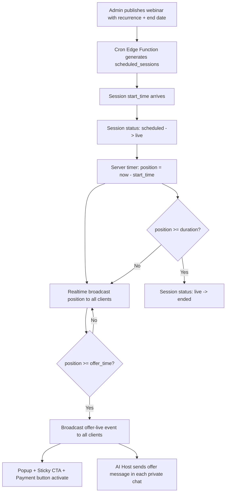
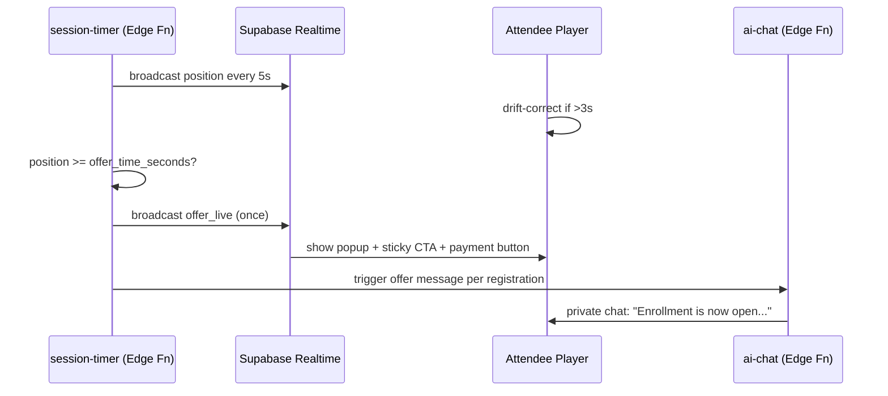

# Automated Scheduled Webinar Platform — Architecture & Implementation Plan

> **MVP principle:** Reliability over features. Every feature works end-to-end with real backend integration before any advanced functionality is added.

---

## 1. Platform Model — Scheduled Automated Webinar

This is **not** an evergreen replay platform. It is a **scheduled automated webinar platform** that simulates a live event.

### Core concept
- Admin configures a webinar **once** and sets a recurrence (e.g. Sun / Tue / Thu at 11:00 AM) plus an optional end date.
- The system auto-generates **scheduled sessions** ahead of time.
- At the session start time, **one shared webinar timeline** begins.
- Every attendee who joins that session watches the **same point in the video**, computed server-side as `now - session.start_time`.
- Late joiners are seeked forward to the current position — they do **not** start from the beginning.
- Offer triggers fire **once for everyone** when the shared timeline reaches the configured offer time.
- AI Host replies **privately** to each attendee; attendees never see each other.

### Shared timeline diagram



---

## 2. Tech Stack

| Layer | Choice |
|-------|--------|
| Framework | Next.js 14+ (App Router) |
| Language | TypeScript (strict) |
| Database | Supabase Postgres |
| Auth | Supabase Auth (admin email/password) |
| Storage | Supabase Storage (MP4 uploads, PDF/notes) |
| Realtime | Supabase Realtime (broadcast + presence) |
| Edge Functions | Supabase Edge Functions (Deno) — session generation cron, timer broadcast, offer trigger, AI chat |
| Vector search | Supabase pgvector extension |
| AI | Provider-agnostic abstraction layer, OpenAI default (GPT-4o) |
| Payments | Razorpay Payment Link (redirect flow) |
| UI | Tailwind CSS + shadcn/ui |
| State | React Server Components + client stores (Zustand for attendee session) |

---

## 3. Folder Structure

```
webinar-automation/
├── app/
│   ├── (public)/
│   │   ├── page.tsx                      # landing redirect / marketing
│   │   ├── w/[webinarSlug]/page.tsx      # landing/register page
│   │   ├── join/[sessionToken]/page.tsx  # webinar experience
│   │   └── thank-you/page.tsx
│   ├── admin/
│   │   ├── login/page.tsx
│   │   ├── layout.tsx                    # protected layout + sidebar
│   │   ├── page.tsx                      # dashboard
│   │   ├── webinars/
│   │   │   ├── page.tsx                  # list
│   │   │   ├── new/page.tsx              # builder
│   │   │   └── [id]/edit/page.tsx        # builder
│   │   ├── registrations/page.tsx
│   │   ├── analytics/page.tsx
│   │   └── settings/page.tsx
│   └── api/                              # route handlers (thin, call services)
├── components/
│   ├── admin/                            # builder sections, dashboard cards
│   ├── webinar/                          # VideoPlayer, OfferBar, AiChat, Popup
│   └── ui/                               # shadcn primitives
├── lib/
│   ├── supabase/
│   │   ├── client.ts                     # browser client
│   │   ├── server.ts                     # RSC server client
│   │   └── admin.ts                       # service-role client (Edge Fns only)
│   ├── ai/
│   │   ├── provider.ts                   # interface
│   │   ├── openai.ts                     # OpenAI impl
│   │   ├── rag.ts                        # pgvector retrieval
│   │   └── prompt-builder.ts             # offer-aware system prompt
│   ├── services/                         # business logic (webinar, session, registration, offer, analytics)
│   └── utils/
├── supabase/
│   ├── migrations/                       # SQL migrations
│   ├── functions/
│   │   ├── session-generator/            # cron: generate scheduled_sessions
│   │   ├── session-timer/                # broadcast current position
│   │   ├── offer-trigger/                # detect offer time, broadcast
│   │   ├── ai-chat/                      # private chat completion + RAG
│   │   └── payment-webhook/              # Razorpay success -> record purchase
│   └── config.toml
├── stores/
│   └── attendeeSession.ts                # Zustand: position, offer status, chat
├── types/
│   └── database.ts                       # generated from Supabase
└── plans/
    └── architecture.md
```

---

## 4. Database Schema

### `admins`
Managed by Supabase Auth (`auth.users`). A `profiles` table links to admin role.

```sql
create table public.admin_profiles (
  id uuid primary key references auth.users(id) on delete cascade,
  email text not null,
  created_at timestamptz default now()
);
```

### `webinars`
```sql
create table public.webinars (
  id uuid primary key default gen_random_uuid(),
  title text not null,
  description text,
  slug text unique not null,
  speaker text,
  video_type text not null check (video_type in ('mp4','youtube','vimeo')),
  video_url text,                    -- storage path for mp4, or external URL
  thumbnail text,
  duration_seconds int not null,     -- admin enters or auto-detected
  status text not null default 'draft' check (status in ('draft','published','archived')),
  created_at timestamptz default now(),
  updated_at timestamptz default now()
);
```

### `scheduled_sessions`
```sql
create table public.scheduled_sessions (
  id uuid primary key default gen_random_uuid(),
  webinar_id uuid not null references public.webinars(id) on delete cascade,
  start_time timestamptz not null,
  end_time timestamptz not null,    -- start_time + duration_seconds
  status text not null default 'scheduled' check (status in ('scheduled','live','ended','cancelled')),
  created_at timestamptz default now()
);
create index on public.scheduled_sessions (webinar_id, start_time);
```

### `recurrence_rules` (admin-set recurrence + end date)
```sql
create table public.recurrence_rules (
  id uuid primary key default gen_random_uuid(),
  webinar_id uuid not null references public.webinars(id) on delete cascade,
  days_of_week int[] not null,      -- [0=Sun..6=Sat], e.g. [0,2,4]
  time_of_day time not null,        -- 11:00
  timezone text not null default 'Asia/Kolkata',
  end_date date,                    -- nullable = no end
  created_at timestamptz default now()
);
```

### `registrations`
```sql
create table public.registrations (
  id uuid primary key default gen_random_uuid(),
  session_id uuid not null references public.scheduled_sessions(id) on delete cascade,
  webinar_id uuid not null references public.webinars(id),
  name text not null,
  email text not null,
  join_token uuid unique default gen_random_uuid(),  -- used in join URL
  joined_at timestamptz,
  purchase_status text not null default 'none' check (purchase_status in ('none','clicked','purchased')),
  created_at timestamptz default now(),
  unique (session_id, email)
);
create index on public.registrations (session_id);
```

### `offers`
```sql
create table public.offers (
  id uuid primary key default gen_random_uuid(),
  webinar_id uuid not null references public.webinars(id) on delete cascade,
  offer_time_seconds int not null,   -- when in timeline offer goes live
  title text not null,
  button_text text not null,
  payment_link text not null,
  popup_title text,
  popup_description text,
  created_at timestamptz default now()
);
```

### `ai_instructions`
```sql
create table public.ai_instructions (
  id uuid primary key default gen_random_uuid(),
  webinar_id uuid unique not null references public.webinars(id) on delete cascade,
  system_prompt text not null,
  personality text,
  rules text,
  sales_copy text,
  created_at timestamptz default now()
);
```

### `ai_knowledge` (RAG source documents)
```sql
create table public.ai_knowledge (
  id uuid primary key default gen_random_uuid(),
  webinar_id uuid not null references public.webinars(id) on delete cascade,
  source_type text not null check (source_type in ('faq','pdf','notes','sales_page','transcript')),
  title text,
  content text not null,
  embedding vector(1536),           -- pgvector
  created_at timestamptz default now()
);
create index on public.ai_knowledge using ivfflat (embedding vector_cosine_ops);
```

### `chat_messages` (private per attendee)
```sql
create table public.chat_messages (
  id uuid primary key default gen_random_uuid(),
  registration_id uuid not null references public.registrations(id) on delete cascade,
  role text not null check (role in ('user','assistant')),
  content text not null,
  created_at timestamptz default now()
);
create index on public.chat_messages (registration_id, created_at);
```

### `analytics_events`
```sql
create table public.analytics_events (
  id uuid primary key default gen_random_uuid(),
  webinar_id uuid not null references public.webinars(id),
  session_id uuid references public.scheduled_sessions(id),
  registration_id uuid references public.registrations(id),
  event_type text not null check (event_type in ('register','join','offer_click','purchase','complete')),
  occurred_at timestamptz default now()
);
create index on public.analytics_events (webinar_id, event_type);
```

### Row Level Security
- `webinars`, `offers`, `ai_instructions`, `ai_knowledge`, `recurrence_rules`, `scheduled_sessions`: admin-only write; public read for published webinars.
- `registrations`, `chat_messages`: insert by attendee using `join_token`; select own rows only.
- `analytics_events`: insert via service role (Edge Functions); admin-only select.

---

## 5. Server-Authoritative Timer & Realtime

### Position computation
```
current_position = now() - session.start_time   (when status = 'live')
```

### Realtime channels
- `session:{session_id}` (broadcast)
  - `position` — pushed every 5 seconds by `session-timer` Edge Function (or a long-running function triggered on session start).
  - `offer_live` — pushed once by `offer-trigger` when position >= offer_time.
  - `session_ended` — pushed when position >= duration.

### Client sync logic
1. On join, attendee fetches current position from `/api/session/[id]/position`.
2. Player seeks to that position and plays.
3. Client subscribes to `session:{session_id}` Realtime channel.
4. On each `position` event, if `|player.currentTime - serverPosition| > 3s`, seek to serverPosition.
5. Pause control is hidden/disabled for attendees (matches "cannot pause for everyone" rule). Volume, fullscreen, playback speed remain.

### Edge Functions
- `session-generator` (cron, daily): for each published webinar with a recurrence rule, ensure `scheduled_sessions` exist up to `min(end_date, today + 14 days)`. Also flip `status` to `live` when `start_time <= now < end_time`, and to `ended` when `now >= end_time`.
- `session-timer`: invoked on session start; loops every 5s broadcasting position; terminates on session end. (Alternative: a cron every minute + client interpolation — simpler but less precise. We'll implement the broadcast loop for reliability.)
- `offer-trigger`: checks each live session's position against its webinar's `offers.offer_time_seconds`; when reached, broadcasts `offer_live` and inserts an `analytics_events` row; idempotent per session.
- `ai-chat`: receives `{ registration_id, message }`, loads `ai_instructions` + RAG retrieval from `ai_knowledge` (pgvector cosine similarity), builds offer-aware system prompt (offer status depends on current session position), calls provider abstraction, stores both messages, returns assistant reply.
- `payment-webhook`: Razorpay webhook → mark `registrations.purchase_status = 'purchased'`, insert `analytics_events(purchase)`.

---

## 6. AI Host — Provider-Agnostic Abstraction

```ts
// lib/ai/provider.ts
export interface AIProvider {
  chatCompletion(params: {
    systemPrompt: string;
    messages: { role: 'user'|'assistant'; content: string }[];
    contextChunks: string[];
  }): Promise<string>;
  embed(text: string): Promise<number[]>;
}
```

- `lib/ai/openai.ts` implements `AIProvider` using OpenAI SDK.
- `lib/ai/rag.ts` embeds knowledge docs on upload, retrieves top-k chunks by cosine similarity for each user query.
- `lib/ai/prompt-builder.ts` assembles: system prompt (admin config) + personality + rules + retrieved context + offer-status directive ("Offer is NOT live yet — do not encourage purchase" vs "Offer is live — encourage enrollment using the button").
- Knowledge ingestion: when admin uploads FAQ/PDF/notes/transcript, an Edge Function chunks + embeds + inserts into `ai_knowledge`.

---

## 7. Offer Automation Flow



---

## 8. Payment Flow

1. Attendee clicks payment button → `analytics_events(offer_click)` recorded.
2. Browser redirects to Razorpay Payment Link (admin-configured URL).
3. On payment success, Razorpay webhook → `payment-webhook` Edge Function → update `registrations.purchase_status`, insert `analytics_events(purchase)`.
4. Attendee lands on `/thank-you`.

> MVP uses a single payment link per offer. Multiple offers/coupons are future enhancements.

---

## 9. Admin Webinar Builder Sections

| Section | Fields |
|---------|--------|
| General | title, description, slug, speaker, thumbnail, duration |
| Video | type (mp4/youtube/vimeo), upload MP4 → Supabase Storage, or external URL |
| AI | system_prompt, personality, rules, sales_copy; upload FAQ/PDF/notes/transcript → embedded |
| Offer | offer_time (HH:MM:SS → seconds), title, button_text, payment_link, popup_title, popup_description |
| Schedule | days_of_week, time_of_day, timezone, end_date (optional) |
| Publish | status toggle draft↔published; on publish, `session-generator` runs immediately |

---

## 10. Analytics Dashboard

Cards / metrics per webinar (and global):
- Total webinars
- Today's registrations
- Registrations (total, per session)
- Live viewers (current live session presence count)
- Completed webinars (ended sessions)
- Offer clicks
- Purchases
- Revenue (sum where purchased)
- Conversion % = purchases / registrations

Backed by `analytics_events` aggregation queries.

---

## 11. Frontend Routes

| Route | Purpose |
|-------|---------|
| `/` | marketing/redirect |
| `/w/[webinarSlug]` | public landing + register form |
| `/join/[sessionToken]` | webinar experience (video, offer, chat) |
| `/thank-you` | post-purchase |
| `/admin/login` | admin login |
| `/admin` | dashboard |
| `/admin/webinars` | list |
| `/admin/webinars/new` | builder (create) |
| `/admin/webinars/[id]/edit` | builder (edit) |
| `/admin/registrations` | registrations table |
| `/admin/analytics` | analytics |
| `/admin/settings` | settings |

---

## 12. Backend APIs (Next.js Route Handlers + Edge Functions)

| Endpoint | Method | Purpose |
|----------|--------|---------|
| `/api/webinars` | POST/GET | create/list webinars (admin) |
| `/api/webinars/[id]` | PATCH/DELETE | update/delete (admin) |
| `/api/webinars/[id]/publish` | POST | set published + trigger session generation |
| `/api/register` | POST | public registration → creates registration + join_token |
| `/api/session/[id]/position` | GET | current server position for late-join sync |
| `/api/offer-click` | POST | record offer click |
| Edge `ai-chat` | POST | private chat completion + RAG |
| Edge `session-generator` | cron | generate + status transitions |
| Edge `session-timer` | invoke | broadcast position loop |
| Edge `offer-trigger` | cron/invoke | detect + broadcast offer_live |
| Edge `payment-webhook` | POST | Razorpay → record purchase |

---

## 13. State Management (Attendee)

Zustand store `attendeeSession`:
- `registration` (id, name, email)
- `session` (id, start_time, status)
- `position` (seconds, from server)
- `offerLive` (boolean)
- `chatMessages` (per registration)
- `purchaseStatus`

Syncs with Supabase Realtime for `position` and `offerLive`; chat via Edge Function calls.

---

## 14. Implementation Phases (execution order)

### Phase 1 — Foundation
1. Next.js project init (App Router, TS, Tailwind, shadcn/ui).
2. Supabase project + env wiring (`lib/supabase/*`).
3. SQL migrations (all tables + RLS + pgvector).
4. Admin auth (Supabase Auth, middleware protection, login page).
5. Admin dashboard shell (sidebar layout, dashboard cards with placeholder data).

### Phase 2 — Webinar Management
6. Webinar builder (all 6 sections) with create/update.
7. MP4 upload to Supabase Storage + external URL option.
8. AI knowledge upload + embedding (Edge Function).
9. Public landing page + registration flow (`/w/[slug]`, `/api/register`).
10. Publish action → `session-generator` Edge Function (recurrence + end date).

### Phase 3 — Webinar Experience
11. `session-generator` cron + status lifecycle.
12. `session-timer` Edge Function + Realtime broadcast.
13. Video player (MP4 + YouTube/Vimeo), server sync, drift correction, pause disabled.
14. `offer-trigger` Edge Function + `offer_live` broadcast.
15. Offer UI (popup, sticky CTA, payment button).
16. AI Host chat (private, provider-agnostic, RAG, offer-aware prompt).
17. Payment redirect (Razorpay link) + `payment-webhook` + thank-you page.

### Phase 4 — Analytics & Polish
18. Analytics dashboard (aggregations from `analytics_events`).
19. Registrations admin view.
20. Settings page.
21. End-to-end manual test of full admin + attendee flow.
22. Documentation (README, env example, deployment notes).

---

## 15. MVP Principles Enforced

- **Keep it simple:** one offer per webinar, one payment link, no coupons, no email reminders in MVP.
- **End-to-end integration:** every UI action calls a real backend route/Edge Function.
- **Single source of truth:** all config (webinar, AI, offer, schedule, analytics) lives in Postgres.
- **Reliable automation:** once published, cron + Edge Functions run sessions with no manual intervention.
- **Modular architecture:** AI provider, video source, payment provider, and offer logic are isolated behind interfaces for future swaps/additions.
